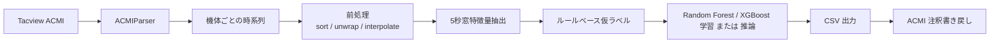

# Flight Maneuver Classifier

Tacview ACMI ログから航空機の機動を分類し、学習、推論、Tacview への書き戻しまで行うためのツール群です。

このリポジトリでは次の 3 つの用途をカバーします。

- ACMI から特徴量を抽出し、ルールベース仮ラベルを付けて Random Forest または XGBoost を学習する
- 学習済みモデルを別の ACMI に適用し、機動ラベルを推論する
- 推論結果とルールベース仮ラベルを Tacview の Raw Telemetry に書き戻す

現在の実装は `Type=Air+FixedWing` のオブジェクトだけを解析対象にします。

## 全体像

処理パイプラインは次のとおりです。



## 主なスクリプト

- `src/maneuver_main.py`
  1 本の ACMI を対象に、特徴量抽出、ルールベース仮ラベル、学習、評価、注釈付き ACMI 出力まで一括で実行します。
- `src/maneuver_train.py`
  複数の ACMI をまとめて学習データ化し、1 つのモデルを学習します。
- `src/maneuver_predict.py`
  学習済みモデルを 1 本以上の ACMI に適用し、推論結果を CSV と注釈付き ACMI に出力します。
- `src/maneuver_acmi_export.py`
  既存のラベル付き CSV から注釈付き ACMI を生成します。

## アルゴリズム

### 1. 対象機体の抽出

解析対象は `Type=Air+FixedWing` のみです。

- 艦船
- 地上ユニット
- `Aircraft` のような曖昧な型
- `Air+Refueling` など `Air+FixedWing` 以外の型

は機動分類の対象外です。

実装: `src/maneuver_feature_engine.py`

### 2. 時系列の構築

各機体について ACMI フレーム列から次の時系列を作ります。

- `time`
- `altitude`
- `speed`
- `heading`
- `pitch`
- `roll`
- `g_load`

実装: `frames_to_aircraft_df()`

### 3. 前処理

前処理では次を行います。

- 時刻順ソート
- `heading` と `roll` の `np.unwrap` による角度連続化
- 欠損値の線形補間
- 補間後も残る欠損の前方埋め、後方埋め

これにより 0°/360° 境界やログ欠損に起因する不連続を減らします。

実装: `preprocess_timeseries()`

### 4. スライディングウィンドウ特徴量

デフォルトでは 5 秒窓、1 秒ステップです。

各窓で次の 27 特徴量を抽出します。

- 平均: `altitude_mean`, `speed_mean`, `heading_mean`, `pitch_mean`, `roll_mean`, `g_load_mean`
- 標準偏差: `altitude_std`, `speed_std`, `heading_std`, `pitch_std`, `roll_std`, `g_load_std`
- 始端終端差: `altitude_delta`, `speed_delta`, `heading_delta`, `pitch_delta`, `roll_delta`, `g_load_delta`
- 線形傾き: `altitude_slope`, `speed_slope`, `heading_slope`, `pitch_slope`, `roll_slope`, `g_load_slope`
- 派生特徴量: `altitude_rate`, `heading_rate`, `roll_abs_mean`

実装: `extract_window_features()`

### 5. ルールベース仮ラベル

教師ラベルが明示的にないため、まずルールベースで仮ラベルを付けます。現在は 14 クラスです。

- `0`: Straight & Level
- `1`: Acceleration
- `2`: Deceleration
- `3`: Steady Climb
- `4`: Steady Descent
- `5`: Level Turn
- `6`: Climbing Turn
- `7`: Descending Turn
- `8`: High-G Turn
- `9`: Dive
- `10`: Zoom Climb
- `11`: Reversal
- `12`: Jinking
- `13`: Extension

判定に使う主な特徴量は次です。

- `heading_delta`, `heading_std`
- `altitude_slope`
- `speed_delta`
- `roll_std`
- `pitch_mean`

実際の判定は `ManeuverLabeler.label_single()` の `if` を上から順に評価します。つまり、下のほうの条件に当てはまっていても、上位条件に先にマッチした時点でそのラベルになります。

優先順位と判定条件は次です。

1. `Jinking`
   `roll_std > roll_std_jinking` かつ `heading_std > heading_std_jinking`
2. `Reversal`
   `abs(heading_delta) >= heading_reversal_threshold`
3. `Dive`
   `pitch_mean < pitch_dive_threshold` かつ `altitude_slope < -altitude_slope_steep` かつ `speed_delta > 0`
4. `Zoom Climb`
   `pitch_mean > pitch_zoom_threshold` かつ `altitude_slope > altitude_slope_steep` かつ `speed_delta < 0`
5. `High-G Turn`
   まず `abs(heading_delta) > heading_delta_threshold` を満たしたうえで、`speed_delta < -speed_loss_highg`
6. `Climbing Turn`
   旋回中で `altitude_slope > altitude_slope_threshold`
7. `Descending Turn`
   旋回中で `altitude_slope < -altitude_slope_threshold`
8. `Level Turn`
   旋回中で、上の旋回派生条件に当てはまらない
9. `Steady Climb`
   非旋回で `altitude_slope > altitude_slope_threshold`
10. `Steady Descent`
   非旋回で `altitude_slope < -altitude_slope_threshold`
11. `Extension`
   非旋回で `speed_delta > extension_speed_gain` かつ `altitude_slope < 0` かつ `altitude_slope >= -altitude_slope_threshold`
12. `Acceleration`
   `speed_delta > speed_delta_threshold`
13. `Deceleration`
   `speed_delta < -speed_delta_threshold`
14. `Straight & Level`
   上記どれにも当てはまらない場合のデフォルト

補足:

- 「旋回中」は `abs(heading_delta) > heading_delta_threshold` です。
- `High-G Turn` は `Climbing Turn` や `Level Turn` より先に判定されます。
- `Extension` は `Acceleration` より先に判定されるので、微降下しながら加速している直線飛行は `Acceleration` ではなく `Extension` になります。

### ルールを変更したい場合

変更箇所は目的ごとに分かれます。

1. 閾値だけ変えたい
   [maneuver_labeler.py](/home/t-kat/src/flight-maneuver-classifier/src/maneuver_labeler.py#L58) の `DEFAULT_THRESHOLDS` を修正します。
2. 判定順や条件式を変えたい
   [maneuver_labeler.py](/home/t-kat/src/flight-maneuver-classifier/src/maneuver_labeler.py#L120) の `label_single()` を修正します。ここがルールベース仮ラベルの本体です。
3. クラス名やクラス ID を変えたい
   [maneuver_labeler.py](/home/t-kat/src/flight-maneuver-classifier/src/maneuver_labeler.py#L35) の `MANEUVER_CLASSES` を修正します。

注意点:

- CLI から閾値を上書きできるので、コード側のデフォルトを変えるだけでは不十分です。CLI の既定値も揃えるなら [maneuver_main.py](/home/t-kat/src/flight-maneuver-classifier/src/maneuver_main.py#L313)、[maneuver_train.py](/home/t-kat/src/flight-maneuver-classifier/src/maneuver_train.py#L193)、[maneuver_predict.py](/home/t-kat/src/flight-maneuver-classifier/src/maneuver_predict.py#L94) の引数デフォルトも更新してください。
- クラス数やクラス ID を変えた場合は、既存モデルや既存 CSV との互換性が崩れます。再学習が必要です。

実装: `src/maneuver_labeler.py`

### 6. モデル学習

仮ラベルを教師信号として `RandomForestClassifier` または `XGBClassifier` を学習します。

デフォルト設定:

- `RandomForestClassifier`
- `n_estimators=200`
- `min_samples_split=5`
- `min_samples_leaf=2`
- `class_weight="balanced"`
- `n_jobs=-1`

GPU を使いたい場合は、`XGBoost` を選びます。

- `--model-type xgboost`
- `--use-gpu`

この指定で `XGBClassifier(tree_method="hist", device="cuda")` を使います。  
ただし、CUDA 対応 GPU と GPU 対応ビルドの `xgboost` が必要です。`Random Forest` では GPU は使いません。

評価指標:

- Accuracy
- Precision
- Recall
- F1-score
- Classification Report
- Confusion Matrix
- Feature Importances

実装: `src/maneuver_classifier.py`

## Tacview への書き戻し

注釈付き ACMI には次のカスタムプロパティを書き込みます。

- `ManeuverLabel`
- `ManeuverLabelId`
- `ManeuverRuleBasedLabel`
- `ManeuverRuleBasedLabelId`
- `ManeuverWindowStart`
- `ManeuverWindowEnd`
- `ManeuverSampleTime`

意味は次です。

- `ManeuverLabel`: 学習済みモデルの予測ラベル。モデル予測がない場合はルールベース仮ラベル
- `ManeuverRuleBasedLabel`: 常にルールベース仮ラベル

Tacview では Raw Telemetry からこれらの値を確認できます。

実装: `src/maneuver_acmi_export.py`

## 使い方

### セットアップ

```bash
python3 -m venv .venv
. .venv/bin/activate
pip install -r requirements.txt
```

### 最初に知っておくこと

- `maneuver_train.py` は「学習用データ作成 + モデル学習」を行うコマンドです。
- `maneuver_train.py` は学習完了後、デフォルトで入力に使った ACMI 群にも自動で予測を書き戻します。
- 学習用の結合 CSV から 1 本の ACMI を直接生成するのではなく、入力 ACMI ごとに個別の注釈付き ACMI を出力します。
- 学習済みモデルを別の ACMI に適用したい場合は、学習後に `maneuver_predict.py` を実行します。
- `maneuver_train.py` の評価用 `train/test` 分割は内部で自動実行されます。
- この分割は ACMI ファイル単位ではなく、抽出されたウィンドウサンプル単位です。
- GPU を使う場合は `--model-type xgboost --use-gpu` を付けます。`--use-gpu` 単独では意味がなく、`Random Forest` ではエラーになります。

### 1 本の ACMI を一括処理する

```bash
. .venv/bin/activate
python src/maneuver_main.py Tacview/flight.zip.acmi --output-dir results/run1
```

生成物:

- `results/run1/maneuver_features_labeled.csv`
- `results/run1/maneuver_rf_model.joblib`
- `results/run1/confusion_matrix.png`
- `results/run1/feature_importances.png`
- `results/run1/<input>.maneuver.zip.acmi`

GPU 学習を使う例:

```bash
. .venv/bin/activate
python src/maneuver_main.py \
  Tacview/flight.zip.acmi \
  --model-type xgboost \
  --use-gpu \
  --output-dir results/run1_gpu
```

この場合のモデル出力名は `results/run1_gpu/maneuver_xgboost_model.joblib` です。

### 複数 ACMI をまとめて学習する

```bash
. .venv/bin/activate
python src/maneuver_train.py \
  Tacview/file1.zip.acmi \
  Tacview/file2.zip.acmi \
  Tacview/file3.zip.acmi \
  --output-dir results/train_run
```

生成物:

- `results/train_run/maneuver_features_labeled.csv`
- `results/train_run/maneuver_rf_model.joblib`
- `results/train_run/confusion_matrix.png`
- `results/train_run/feature_importances.png`
- `results/train_run/predictions/<acmi名>/maneuver_features_labeled.csv`
- `results/train_run/predictions/<acmi名>/<acmi名>.maneuver.zip.acmi`

GPU 学習を使う場合:

```bash
. .venv/bin/activate
python src/maneuver_train.py \
  Tacview \
  --recursive \
  --model-type xgboost \
  --use-gpu \
  --output-dir results/train_run_gpu
```

この場合のモデル出力名は `results/train_run_gpu/maneuver_xgboost_model.joblib` です。

この CSV は複数 ACMI を結合した学習データです。`source_acmi` 列と `source_title` 列で由来を追えます。

重要:

- `results/train_run/maneuver_features_labeled.csv` は学習用に結合された CSV です。
- これは複数 ACMI の窓が混ざったデータなので、この CSV をそのまま 1 本の ACMI に書き戻す用途には向きません。
- そのため、`maneuver_train.py` は学習用の結合 CSV とは別に、各入力 ACMI ごとの予測結果を `predictions/` 配下へ自動出力します。

ディレクトリをそのまま渡すこともできます。デフォルトではそのディレクトリ直下の `*.acmi` を読み込みます。

```bash
. .venv/bin/activate
python src/maneuver_train.py Tacview --output-dir results/train_run
```

サブディレクトリも含めて探索したい場合は `--recursive` を使います。

```bash
. .venv/bin/activate
python src/maneuver_train.py Tacview --recursive --output-dir results/train_run
```

ファイルとディレクトリを混在させることもできます。

```bash
. .venv/bin/activate
python src/maneuver_train.py \
  Tacview \
  Tacview/special_case.zip.acmi \
  --recursive \
  --output-dir results/train_run
```

内部で何が起きるか:

1. 指定した ACMI 群から特徴量とルールベース仮ラベルを抽出
2. それらを 1 つのデータセットに結合
3. 窓サンプル単位で `train/test` に分割
4. 指定したモデルを学習
5. 学習済みモデルを `maneuver_rf_model.joblib` または `maneuver_xgboost_model.joblib` として保存
6. 入力に使った各 ACMI に対して予測結果を自動で書き戻し、`predictions/` 配下に保存

つまり、`python src/maneuver_train.py Tacview --output-dir results/train_run` を実行しても、全データが `train` に入るわけではありません。結合後のデータセット全体から、一部が自動で `test` に回されます。

学習後の自動書き戻しを止めたい場合は `--no-annotate-inputs` を使います。

```bash
. .venv/bin/activate
python src/maneuver_train.py Tacview \
  --output-dir results/train_run \
  --no-annotate-inputs
```

自動書き戻しの出力先を変えたい場合は `--prediction-output-dir` を使います。

```bash
. .venv/bin/activate
python src/maneuver_train.py Tacview \
  --output-dir results/train_run \
  --prediction-output-dir results/train_predictions
```

### 学習済みモデルを別データに適用する

```bash
. .venv/bin/activate
python src/maneuver_predict.py \
  Tacview/new_flight.zip.acmi \
  --model results/train_run/maneuver_rf_model.joblib \
  --output-dir results/predict_run
```

学習済みモデルを入力とは別の ACMI に書き戻したいときは、この `maneuver_predict.py` を使います。

複数ファイルにも対応します。

```bash
. .venv/bin/activate
python src/maneuver_predict.py \
  Tacview/new1.zip.acmi \
  Tacview/new2.zip.acmi \
  --model results/train_run/maneuver_rf_model.joblib \
  --output-dir results/predict_run
```

出力はファイルごとのサブディレクトリに分かれます。

- `results/predict_run/<acmi名>/maneuver_features_labeled.csv`
- `results/predict_run/<acmi名>/<acmi名>.maneuver.zip.acmi`

推論でもディレクトリ入力に対応しています。

```bash
. .venv/bin/activate
python src/maneuver_predict.py Tacview \
  --model results/train_run/maneuver_rf_model.joblib \
  --output-dir results/predict_run
```

サブディレクトリも含める場合:

```bash
. .venv/bin/activate
python src/maneuver_predict.py Tacview --recursive \
  --model results/train_run/maneuver_rf_model.joblib \
  --output-dir results/predict_run
```

学習直後に別の入力群へ適用したい場合の例:

```bash
. .venv/bin/activate
python src/maneuver_train.py Tacview --output-dir results/train_run
python src/maneuver_predict.py Tacview \
  --model results/train_run/maneuver_rf_model.joblib \
  --output-dir results/predict_run
```

`--model` には `maneuver_rf_model.joblib` でも `maneuver_xgboost_model.joblib` でも指定できます。

### 既存 CSV から ACMI だけ書き戻す

```bash
. .venv/bin/activate
python src/maneuver_acmi_export.py \
  Tacview/flight.zip.acmi \
  --labels-csv results/run1/maneuver_features_labeled.csv \
  --output results/run1/flight.maneuver.zip.acmi
```

## 主要オプション

共通でよく使うもの:

- `--window`
  スライディングウィンドウ幅。デフォルト 5 秒
- `--step`
  ウィンドウのステップ幅。デフォルト 1 秒
- `--aircraft-id`
  特定機体だけ処理したいときに使用
- `--output-dir`
  出力ディレクトリ
- `--model-type`
  学習に使う分類器。`random_forest` または `xgboost`
- `--use-gpu`
  `xgboost` 選択時に CUDA GPU を使う
- `--recursive`
  ディレクトリ入力時にサブディレクトリも再帰的に探索する
- `--no-annotate-inputs`
  `maneuver_train.py` 実行後の入力 ACMI への自動書き戻しを無効化する
- `--prediction-output-dir`
  `maneuver_train.py` の自動書き戻し結果の出力先を指定する

ルールベース閾値:

- `--heading-delta-th`
- `--heading-reversal-th`
- `--altitude-slope-th`
- `--altitude-slope-steep`
- `--speed-delta-th`
- `--speed-loss-highg`
- `--roll-std-jinking`
- `--heading-std-jinking`

`maneuver_main.py` 固有:

- `--list-aircraft`
  入力 ACMI に含まれる解析対象機体一覧だけ表示
- `--no-annotate-acmi`
  自動 ACMI 出力を無効化
- `--annotated-acmi-output`
  注釈付き ACMI の出力先を明示指定

## 再学習の考え方

このプロジェクトの学習器は `Random Forest` または `XGBoost` ですが、どちらもこの実装では追加データだけを使った継ぎ足し学習はしません。

新しい学習データを増やしたい場合は、次の運用になります。

1. 新しい ACMI を収集する
2. `maneuver_train.py` に過去の ACMI と新しい ACMI を全部渡す
3. 毎回まとめて再学習する
4. 新しく出た `maneuver_rf_model.joblib` または `maneuver_xgboost_model.joblib` を以後の推論で使う

実務的には、学習に使った ACMI 群を固定して `results/train_run/` のようなディレクトリ単位で管理するのが安全です。

## ファイル構成

- `src/acmi_parser.py`
  Tacview ACMI パーサ
- `src/maneuver_feature_engine.py`
  時系列化、前処理、特徴量抽出
- `src/maneuver_labeler.py`
  14 クラスのルールベース仮ラベル
- `src/maneuver_classifier.py`
  Random Forest / XGBoost 学習、評価、モデル保存
- `src/maneuver_pipeline.py`
  学習、推論で共通利用するパイプライン関数
- `src/maneuver_main.py`
  単一 ACMI 一括実行
- `src/maneuver_train.py`
  複数 ACMI 学習 CLI
- `src/maneuver_predict.py`
  学習済みモデル推論 CLI
- `src/maneuver_acmi_export.py`
  Tacview 書き戻し

## テスト

```bash
. .venv/bin/activate
pytest -q
```

現時点では全テストが通っています。

## 注意点

- ルールベース仮ラベルはあくまで擬似教師です。閾値の妥当性がモデル性能に直結します。
- 学習データの偏りが大きいと、よく出るクラスに引っ張られます。
- `ManeuverLabel` はモデル予測、`ManeuverRuleBasedLabel` は仮ラベルなので、両者が一致しない窓があります。
- 入力ログ品質が悪い場合、速度や姿勢の補間が推論結果に影響します。
- 現在の対象は `Air+FixedWing` のみです。

## 実装の現状

この README は現在のコード実装に合わせて書いています。

- 14 クラスのルールベース仮ラベル
- `Air+FixedWing` 限定の解析対象
- 複数 ACMI 学習
- 学習済みモデルの別データ適用
- Tacview Raw Telemetry への `ManeuverLabel` / `ManeuverRuleBasedLabel` 書き戻し
